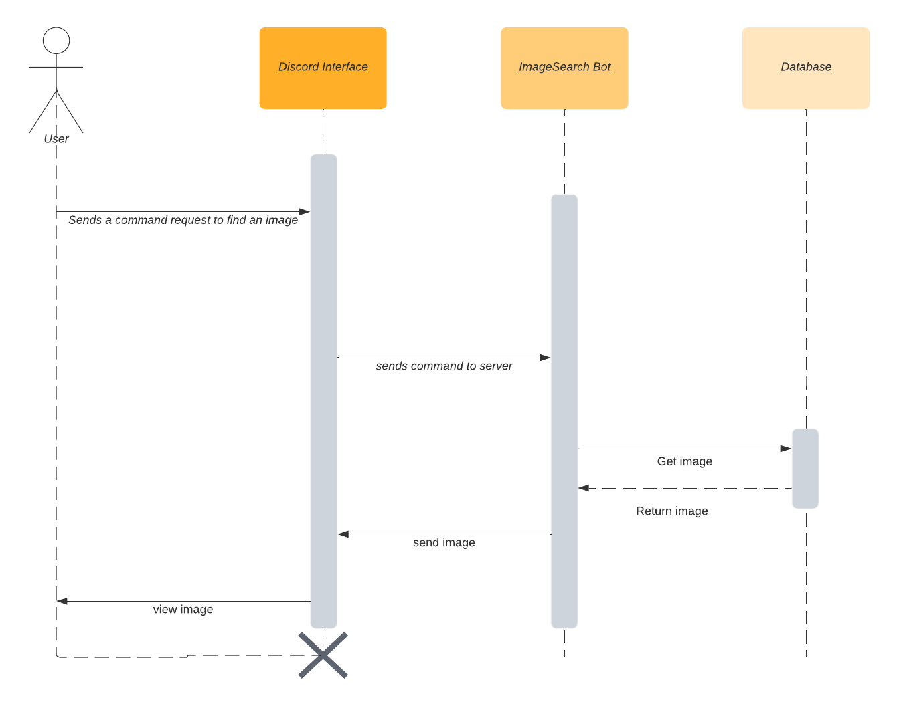
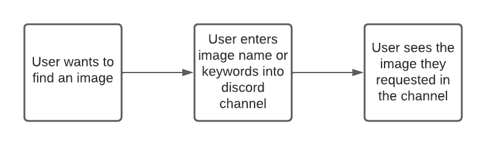
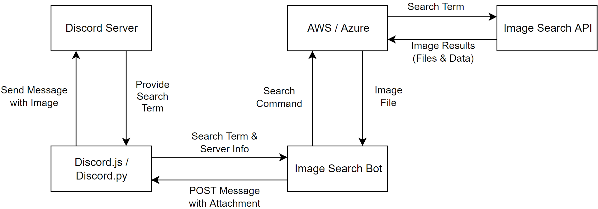

# Google Image Search Bot for Discord

## Problem Statement

Discord is an increasingly popular communication platform. As of September 2021, Discord had [over 150 million monthly active users](https://www.statista.com/statistics/1286750/discord-mau-global/). An important aspect of online communication is image sharing. While most use cases involve sharing image that is already saved locally on the user’s device, a common use case is needing to send an image from the internet. Currently, this requires a Discord user to open a browser tab, type in a search term in their preferred search engine, navigate to the “images” page, copy/save the image they want to send, return to Discord, and then finally attach the image and send the message. A fundamental principle of communication platforms is to avoid situations where the user is required to navigate away.

Discord has already addressed this problem in other areas. Without needing to navigate away from the field where messages are composed, users can format their text, search for emoji, and even search for GIFs (powered by Tenor). Given these existing tools, it seems like a strange omission that this principle is violated when users would like to search images online.

## Bot Description

> **_“Image search for Discord”_**

This bot will receive a search term from the user and automatically retrieve and send the first image matching that search term from Google Images. To retrieve the search term, users will utilize [Slash Commands](https://discord.com/blog/slash-commands-are-here) as this is the current standard for communicating with bots on Discord and instills confidence that the user is properly communicating with the bot. The message content will be dynamic, so if the user is not satisfied with the result they can easily request another image. This can be achieved by a “Next result” (and a “Previous result”) button that the user can click, which will trigger the bot to send the next available image from the search results. A bot is an ideal solution for this problem because, by definition, bots are agents of automation designed to perform automated, repetitive, and predefined tasks. Users who need to send multiple images from the internet consecutively in Discord are required to repeat the aforementioned steps, meaning the time it takes to complete this process can significantly scale up.

The design of this bot would provide results based on specific inquiries. A basic implementation of this bot would follow the simple reactor pattern. The event will be a user sending the command to search for an image. This will trigger the bot to react by retrieving the first image from a Google Images search and sending that message in the same Discord channel where it was triggered. If the functionality to request subsequent images beyond the first result is implemented, the bot would follow a responder pattern as it needs to maintain a memory of which images it has already provided.

## Use Cases

### Use Case 1: Search Google Images

1. Preconditions
    1. Bot has been authorized to send messages in all or specific channels in an existing Discord server.
2. Main flow
    1. User will provide a search term for the bot [S1]. Bot will search Google Images for that search term [S2]. Bot will retrieve image [S3]. Bot will send image to Discord channel [S4]. User can request bot provides a different image until satisfied with the result [E1].
3. Subflows
    1. [S1] User will use a slash command in the format `/image <search term>`.
    2. [S2] Bot calls a search on Google Images for that specific search term.
    3. [S3] Bot will save a copy of the image as well as a link to the website hosting the image.
    4. [S4] Bot will send that image to the Discord channel it was called from.
4. Alternative Flows
    1. [E1] User will click a “Next” or “Previous” button to have the bot retrieve the next available image for that search term.

### Use Case 2: View Image Source

1. Preconditions
    1. Bot has already sent an image as described in **Use Case 1**.
2. Main flow
    1. User will request to view the image on the website where it has been published [S1]. Bot will provide link [S2]. User visits website [S3].
3. Subflows
    1. [S1] User will click “View Original” button.
    2. [S2] Bot will send a link to the image that it has currently displayed.
    3. [S3] User will click the link and be redirected to that originating webpage.
4. Alternative Flows
    1. [E1] User does not open the link provided by the bot.

## Design Sketches

### Sequence Diagram

### Storyboard

## Architecture Design

After debating on several different applications that we could potentially host our bot on, we decided on using Discord. Discord has many features that are utilized by millions of users everyday, but we realized that it does not have a function/command that allows the user to find and send a picture from the Internet through the application itself. Currently, users have to go to a web browser and manually search, find, and copy-and-paste the desired picture onto Discord. This bot would eliminate this process. 

For our bot design, it will be a Discord feature and we want to have a command that can allow the user to search a term for a picture they want. The command will be sent to Discord.js/Discord.py, which is where the command is hosted. The search term and server information will then be sent to the Image Search Bot, where the search command will be activated and actually search the term the user has inputted. The search command is stored on AWS/Azure, the hosting server, where the search command is sent and will search it on an Image Search API.

### Components

* Hosting Service Provider: Amazon Web Services (AWS) or Azure
* [Discord API](https://discord.com/developers/docs/reference) Interfaces: [Discord.js](https://discord.js.org/) or [Discord.py](https://discordpy.readthedocs.io/en/stable/#)
* Image Search API:  [SerpApi](https://serpapi.com/images-results) or make a [Google Programmable Search Engine](https://programmablesearchengine.google.com) and [Google-Images-Search 1.4.1](https://pypi.org/project/Google-Images-Search/) (Python) or [Usearch Image Search API](https://usearch.com/image-search-api/) or [use another solution](https://www.scraperapi.com/blog/best-google-image-search-apis-and-proxies/)
